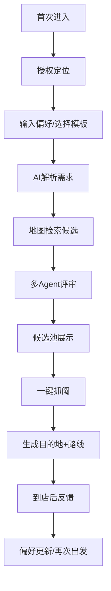

# 产品需求文档（PRD）
## 产品定位

**一句话定位**：一个基于多 Agent 的“附近去处决策器”，用户只说心情/预算/通勤方式，AI 完成筛选、讨论与随机拍板。
**目标用户**：一二线城市 20–35 岁上班族；周末/下班后有出门需求，但不想做攻略，存在选择困难。
**核心价值**：把“搜附近→看评价→纠结”压缩成“说需求→直接出发”，同时保留随机探索感。
**差异点**：不同于地图/点评的“给列表”，本产品提供“约束随机 + 可解释决策”。

## 用户流程



**说明**：
首次使用先完成定位与偏好初始化；核心任务是“输入一句话需求→查看候选→随机选 1 个”；留存依赖三点：历史记录、个人偏好学习、主题模式（独处/约会/恢复状态）。

## Agent 架构

| Agent            | 职责          | 输入              | 输出           | 调用关系              |
| ---------------- | ----------- | --------------- | ------------ | ----------------- |
| Preference Agent | 把自然语言转结构化约束 | 文本、时间、天气、位置     | 类别/预算/距离/排除项 | 被 Orchestrator 调用 |
| Retrieval Agent  | 检索附近 POI    | 结构化约束、地图API     | 候选 POI 列表    | 调地图数据             |
| Review Agent     | 做“数字化探店”摘要  | POI、评论、标签、照片元数据 | 风格/风险/适配度    | 依赖 Retrieval      |
| Critic Agent     | 反向挑毛病、降权    | 候选摘要、价格、热度      | 风险标签、降权建议    | 依赖 Review         |
| Selector Agent   | 加权随机选点      | TopN 候选、权重      | 最终目的地+备选     | 依赖 Critic         |
| Orchestrator     | 编排全流程       | 用户请求            | 最终卡片、解释、埋点   | 调全部 Agent         |

## 推荐算法

**逻辑**：先过滤，再评分，再在 TopN 内加权随机，避免“纯随机翻车”。
**冷启动**：无历史时使用通用规则权重（距离>营业中>预算>评分>热度）；用户首次反馈后更新个人偏好向量。
**数据飞轮**：点击/出发/到店反馈→修正权重与标签→提升后续候选质量。

```python
def recommend(user, query, location, context):
    intent = parse_intent(query, context)
    pois = search_poi(location, intent.radius, intent.categories)
    pois = [p for p in pois if open_now(p) and within_budget(p, intent.budget)]
    scored = []
    for p in pois:
        review = review_agent(p, intent)
        risk = critic_agent(p, review, intent)
        score = (
            w_dist*dist_score(p) +
            w_price*price_score(p, intent) +
            w_match*match_score(review, intent) +
            w_rating*rating_score(p) +
            w_novel*novelty_score(user, p) -
            w_risk*risk.penalty
        )
        scored.append((p, score, review, risk))
    topN = sort_desc(scored)[:5]
    picked = weighted_random(topN, temp=0.7)
    log_exposure(user, topN, picked)
    return picked, topN[:3]

# feedback loop
def update_profile(user, feedback):
    update_user_embedding(user, feedback)
    update_weights_by_bandit(user, feedback)
```

## 页面原型模块

1. **首页**：定位状态、快捷模板、输入框、历史入口；交互为一句话发起。
2. **候选页**：候选卡片、AI探店摘要、风险标签、切换条件；交互为“重筛/抓阄”。
3. **结果页**：最终目的地、大地图、路线、为什么是它、2个备选；交互为导航/重新抽。
4. **反馈页**：是否去了、满意度、真实花费、标签纠偏；交互为一键反馈。
5. **个人页**：偏好画像、历史目的地、主题模式；交互为管理预算/通勤方式。

## MVP 范围

**假设**：首版做 H5/PWA；地图数据接高德 POI；LLM 用外部 API；不做真实多模型并行，采用单模型多角色编排。
**推荐技术栈**：Next.js + Tailwind + FastAPI + PostgreSQL + Redis + 高德地图 API + LLM API + Vercel/云服务器。

| 在 MVP             | 不在 MVP        |
| ----------------- | ------------- |
| 定位授权与一句话输入        | 社交拼单/多人协同决策   |
| 3类场景：独处/约会/朋友     | 真正多模型并行 Agent |
| POI 检索、营业过滤、预算过滤  | 商家入驻后台        |
| AI 探店摘要 + 风险提示    | 用户 UGC 攻略社区   |
| Top5 候选 + 加权随机 选1 | 复杂会员体系        |
| 到店反馈与基础偏好学习       | 跨城行程规划        |
| 历史记录与再次出发         | 语音助手、AR 导航    |
